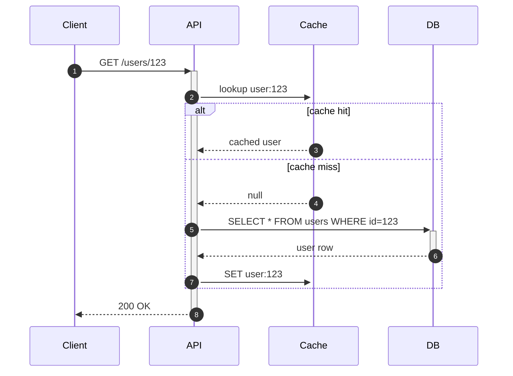
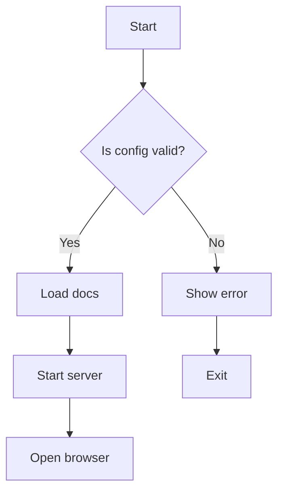
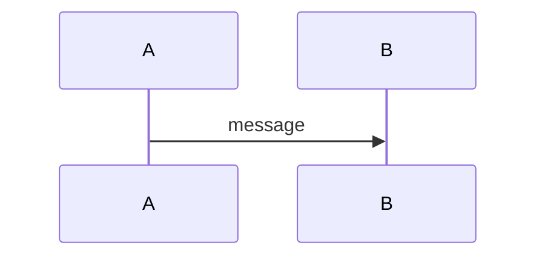

Render Mermaid diagrams directly in your docs. Supports flowcharts, sequence diagrams, and more.

## Sequence Diagram


```mermaid
sequenceDiagram
    autonumber
    participant C as Client
    participant A as API
    participant K as Cache
    participant D as DB

    C->>+A: GET /users/123
    A->>+K: lookup user:123
    alt cache hit
        K-->>A: cached user
    else cache miss
        K-->>A: null
        A->>+D: SELECT * FROM users WHERE id=123
        D-->>-A: user row
        A->>K: SET user:123
    end
    A-->>-C: 200 OK
```

## Flowchart


```mermaid
flowchart TD
    A[Start] --> B{Is config valid?}
    B -->|Yes| C[Load docs]
    B -->|No| D[Show error]
    C --> E[Start server]
    E --> F[Open browser]
    D --> G[Exit]
```

## Syntax

````

```mermaid
sequenceDiagram
    A->>B: message
```
````
